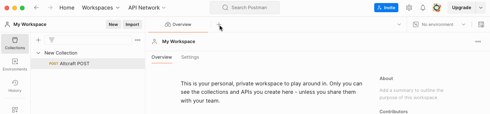
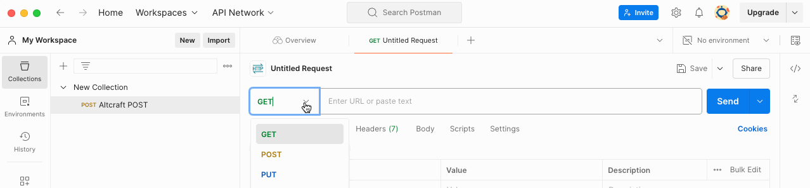
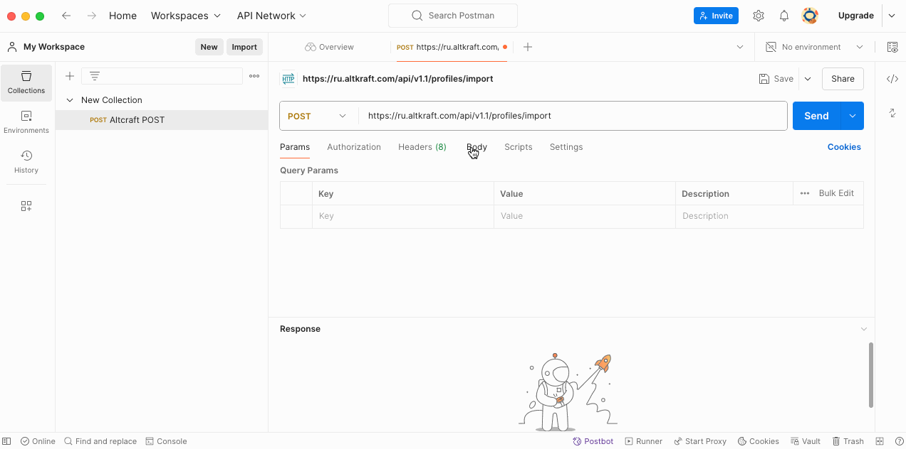
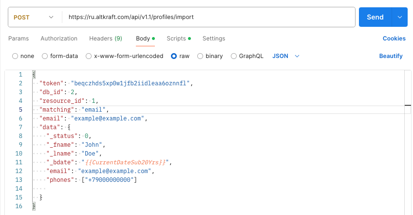
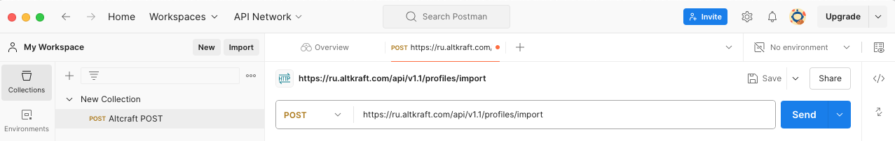
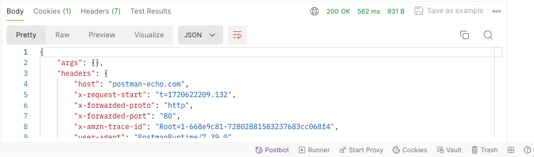
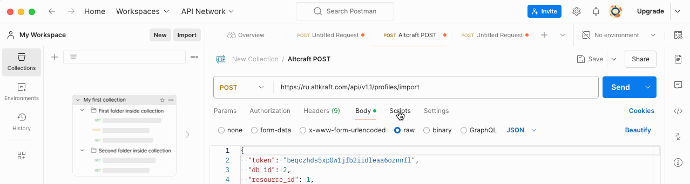

# Как импортировать один профиль клиента в базу данных Altkraft Marketing через Postman

## [Задача](https://github.com/altkraft/for-applicants/blob/master/t.writer/postman/task.md)

## Описание
Добавление профиля клиента в базу данных Altcraft Marketing через Postman.

## API URL
`https://ru.altkraft.com/api/v1.1/profiles/import`

## Параметры запроса
Перед началом работы получите токен и db_id для доступа к API.
Для выполнения запроса также понадобятся данные о клиенте: имя, фамилия, e-mail.
Запрос выполняется в формате JSON.

| Параметр | Тип         | Пример                                           | Обязательный                                     | Описание                                      |
|----------|-------------|--------------------------------------------------|--------------------------------------------------|-----------------------------------------------|
| token    | string      | "abcdefghijklmnqrstuvwxyz"                       | Да                                               | API токен                                     |
| db_id    | int         | 1                                                | Да                                               | Идентификатор базы данных                     |
| matching | string      | "email" – поиск по email из профиля или подписок | Нет, если поиск по email из профиля или подписок | Режим поиска подписчика. По умолчанию – email |
| data     | JSON object | {    "_fname": "John",    "_lname": "Doe" }      | Да                                               | Данные о профиле                              |


## Пример запроса

```
{
"token": "beqczhds5xp0w1jfb2iidleaa6oznnfl",
 "db_id": 2,
 "resource_id": 1,
 "matching": "email",
 "email": "example@example.com",
 "data": {
   "_status": 0,
   "_fname": "John",
   "_lname": "Doe",
   "_bdate": "{{CurrentDateSub20Yrs}}",
   "email": "example@example.com",
   "phones": ["+79000000000"]
  
 }
}
```

## Создание запроса
Для импорта профиля создайте новый запрос в Postman:


Укажите метод ввода POST:


Введите API URL: `https://ru.altkraft.com/api/v1.1/profiles/import`


Перейдите в меню Body, выберите вариант raw. Убедитесь, что форматом запроса выбран JSON.


В поле ввода внесите код запроса:


Нажмите Send для выполнения запроса.


Результат запроса отобразится ниже:


## Переменные
В примере запроса выше была использована переменная `CurrentDateSub20Yrs`. Переменные удобно использовать для сокращения кода и для вычисления некоторых параметров запроса, например, дат.
## Пример скрипта
Переменная `CurrentDateSub20Yrs` нужна для вычисления текущей даты минус 20 лет. Для создания переменной перейдите в меню Scripts и выберите Pre-req (скрипт запустится до выполнения запроса):


В поле ввода внесите код:


```
var moment = require ('moment');
pm.globals.set("CurrentDateSub20Yrs", moment().subtract(20, 'years').format())
```

Таким образом, при выполнении запроса от текущей даты автоматически будет вычитаться 20 лет.

## Примечания
Токен из примера запроса недействителен.

В [документации](https://guides.altcraft.com/developer-guide/api-interaction#id-ВзаимодействиесAPI-Кодыответа) отсутствует описание кода ошибки 440.

[//]: # (Это комментарий, он не будет отображаться)
You can use the [editor on GitHub](https://github.com/msrubtsova/test_task/edit/gh-pages/index.md) to maintain and preview the content for your website in Markdown files.

Whenever you commit to this repository, GitHub Pages will run [Jekyll](https://jekyllrb.com/) to rebuild the pages in your site, from the content in your Markdown files.

### Markdown

Markdown is a lightweight and easy-to-use syntax for styling your writing. It includes conventions for

```markdown
Syntax highlighted code block

# Header 1
## Header 2
### Header 3

- Bulleted
- List

1. Numbered
2. List

**Bold** and _Italic_ and `Code` text

[Link](url) and 
```

For more details see [GitHub Flavored Markdown](https://guides.github.com/features/mastering-markdown/).

### Jekyll Themes

Your Pages site will use the layout and styles from the Jekyll theme you have selected in your [repository settings](https://github.com/msrubtsova/test_task/settings). The name of this theme is saved in the Jekyll `_config.yml` configuration file.

### Support or Contact

Having trouble with Pages? Check out our [documentation](https://docs.github.com/categories/github-pages-basics/) or [contact support](https://support.github.com/contact) and we’ll help you sort it out.
